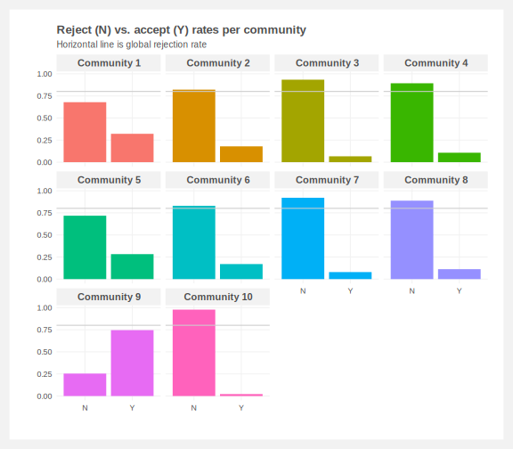

# Classifying California custom license plate requests

**Warning: this dataset contains vulgar and offensive language (quite a lot of it).**

## Initial EDA of license plate ngrams

## The data

See the [original repo](https://github.com/veltman/ca-license-plates) for the full data description details.

`applications.csv` is a CSV of 23,463 personalized license plate applications the California DMV received from 2015-2016.

These do NOT represent all applications received by the DMV during that timeframe, only applications that were flagged for additional review by the Review Committee. The file includes the following columns:

- `plate`: the personalized license plate combination requested.
- `review_reason_code`: Reason code for the application being reviewed (see below for codes).
- `customer_meaning`: Meaning of the plate provided by the applicant.
- `reviewer_comments`: Comments from DMV reviewers.
- `status`: `Y` means the plate was approved, `N` means it was denied.

